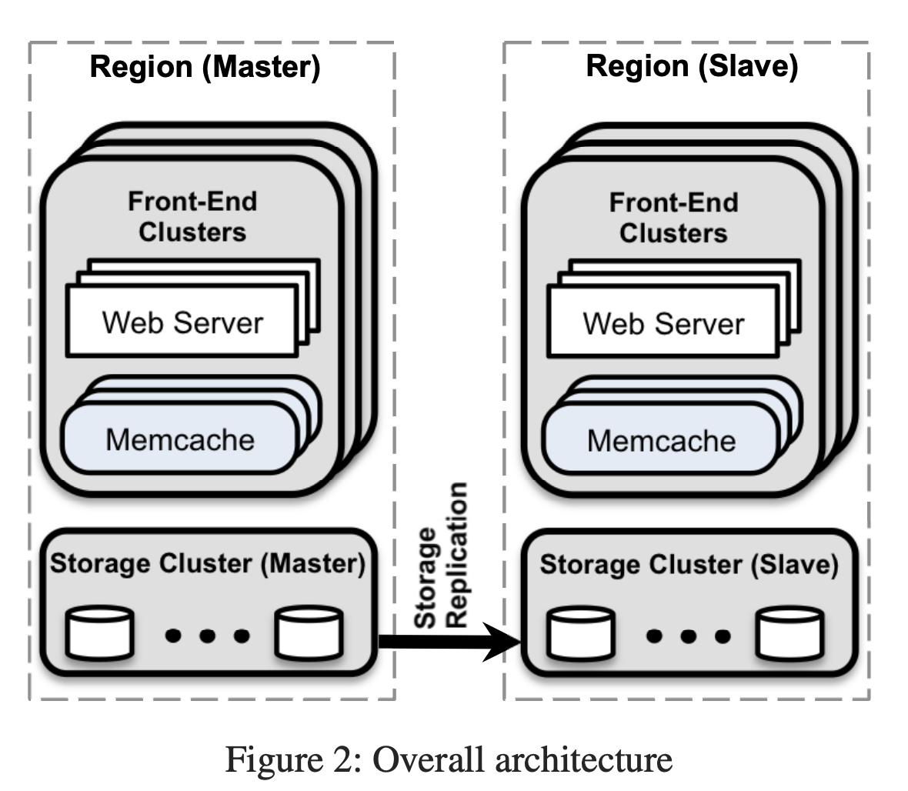
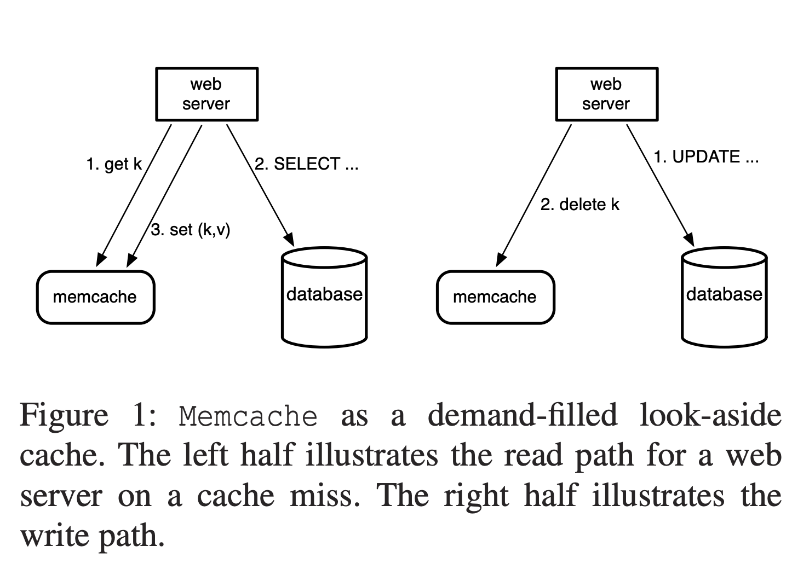

# discoh
discoh stands for **dis**tributed **coh**erence. 
## What is Distributed Coherence?
A distributed system is said to be coherent if and only if, 
  1. all components of the system
  2. have a consistent view of the last written value 
  3. of every key
  4. at any given time.
## How does discoh help me?
If your distriuted system goal is strong consistency without sacrificing availability, Discoh helps you achieve strong consistency with your existing infrastructure. Discoh can be quickly integrated with your existing infrastructure containing either memcached or Redis cache clusters.
## How do I get started?
1. Change your client code to include the following rpc call: v' = discoh_read(k) in parallel along with a v = get(k) to your cache server, whenever you do a read. 
- If discoh_read returns a value, your client takes that value, otherwise the client will take the value v returned by the cache. 
- Don't worry the discoh cache would be invalidated every 60 seconds. (You can change this setting if you want to).
2. Change your client code to include the following rpc call: discoh_pull(k), whenever your client does a write to the database.
- discoh_pull(k) would do a fetch the value from the DB.
- You need to configure the database connection parameters.
3. Deploy a cluster of discoh servers, to mirror the cluster of cache servers.
- If you used consistent hashing to load balance your cache servers, you are in luck, as discoh uses consistent hashing as well. 
## How does the architecture work?
discoh uses the directory-based coherence protocol which is a proven cache coherence mechanism in parallel processors and multicore processors have been in production with the directory based coherence mechanism since 2005.
## Do you have a reference architecture?
Sure. Here is the Facebook Memcached Architecture per the published paper.


Here is how reads happen in the client per the FB architecture:

```
v = get(k);
if v is nil // on a cache miss
   v = fetch_from_db(k)
   set(k,v)  // set the cache with the key,value pair
```

Here is how the modified read in your client with discoh in the architecture:

```
v = **discoh_read(k);**
v' = get(k);
if v is nil // on a cache miss
   if v' is nil
     v = fetch_from_db(k)
     set(k,v)  // set the cache with the key,value pair
   else
      v = v'
```


Here is how writes happen in the FB architecture:
```
update_or_insert_in_db(k,v) // update or insert the key/value pair in the db
delete(k) // delete the key from the cache
```

Here is how the modified write in your client with discoh in the architecture:

```
update_or_insert_in_db(k,v) // update or insert the key/value pair in the db
delete(k) // delete the key from the cache
**discoh_pull(k)**
```

For more detailed information refer to the original paper <http://www.cs.utah.edu/~stutsman/cs6963/public/papers/memcached.pdf>

